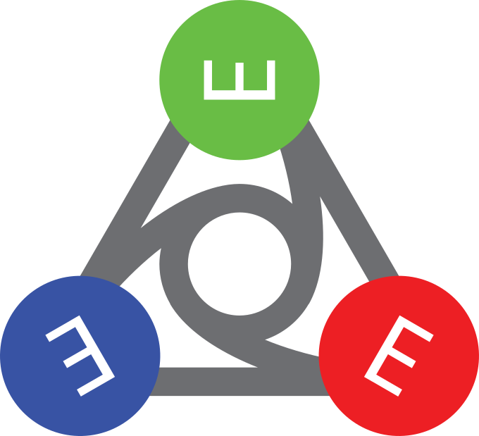
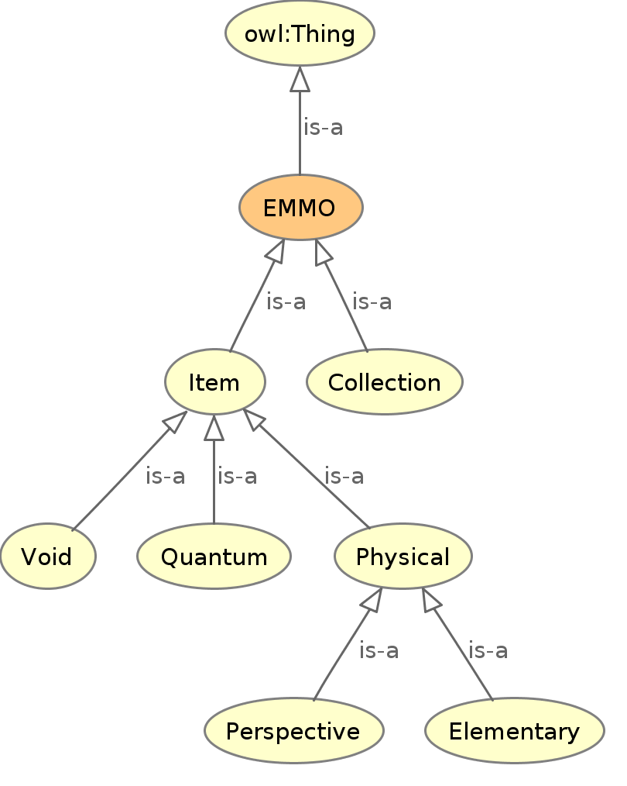
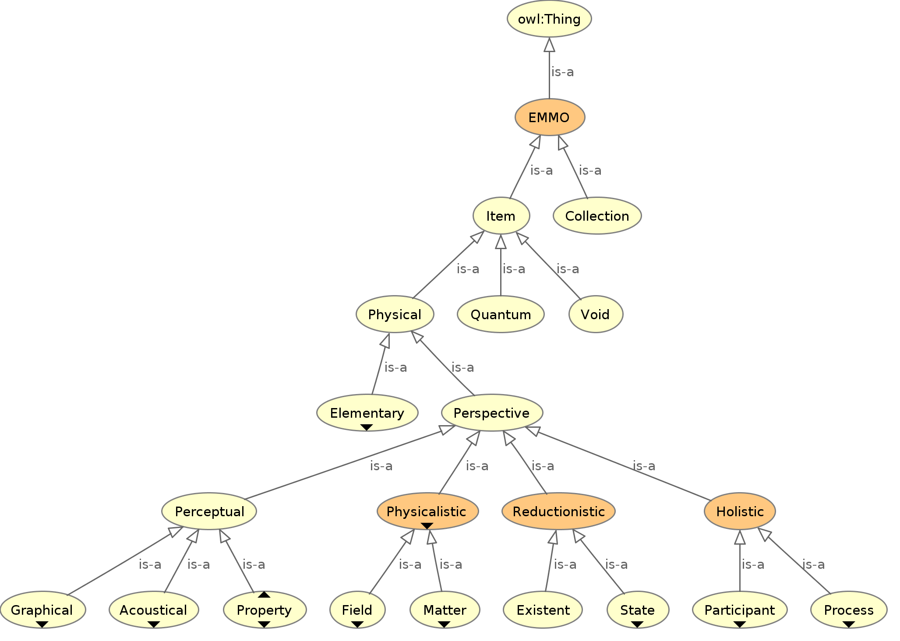
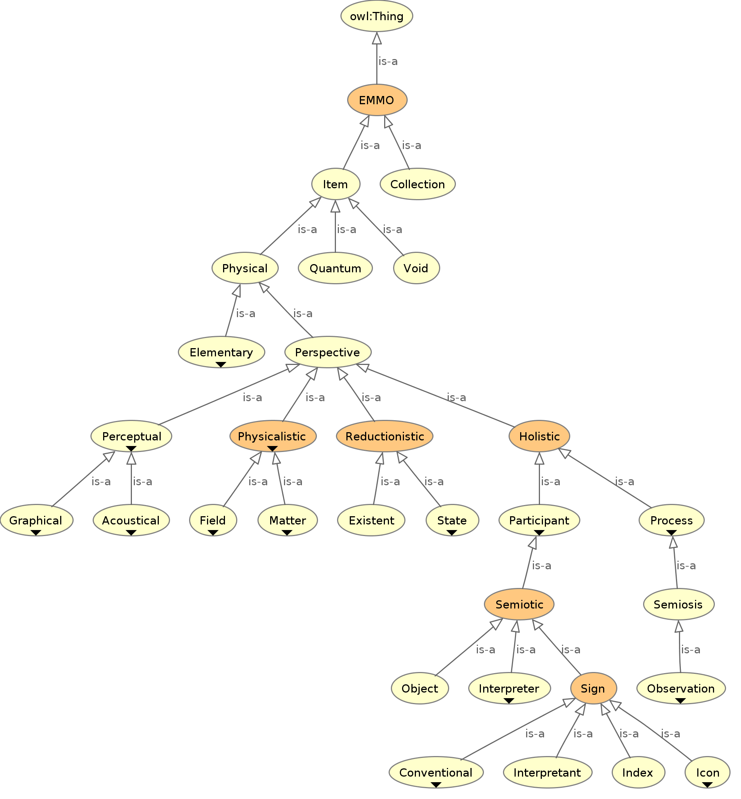
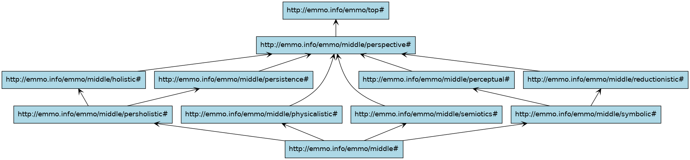
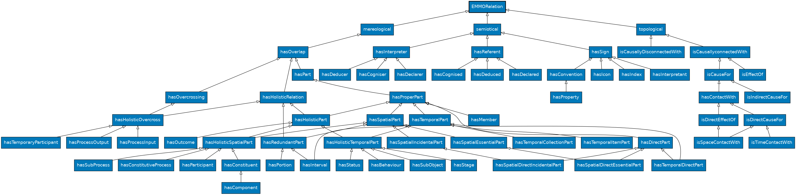

# Elementary Multiperspective Material Ontology (EMMO)

<!-- LOGO -->

  

## Table of content
  * [About EMMO](#about-emmo)
      * [Some words about the new name and logo](#some-words-about-the-new-name-and-logo)
  * [EMMO in a Nutshell](#emmo-in-a-nutshell)
      * [Top Level](#top-level)
      * [Middle Level](#middle-level)
      * [Reference Level](#reference-level)
      * [Domain ontologies](#domain-ontologies)
      * [Application ontologies](#application-ontologies)
      * [EMMO relations](#emmo-relations)
  * [Repository Description](#repository-description)
  * [How to Use It](#how-to-use-it)
      * [Pre-inferred ontology and documentation](#pre-inferred-ontology-and-documentation)
  * [Contacts](#contacts)
  * [Acknowledgement](#acknowledgement)

## About EMMO
EMMO is a multidisciplinary effort to develop a standard representational framework (the ontology) for applied sciences.  It is based on physics, analytical philosophy and information and communication technologies. It has been instigated by materials science to provide a framework for knowledge capture that is consistent with scientific principles and methodologies.  It is released under a Creative Commons [CC BY 4.0](LICENSE.md) license.

### Some words about the new name and logo
The name _Elementary Multiperspective Material Ontology_ should be understood as follows:
- **Elementary** means, amongst others, that EMMO is a discrete ontology assuming the existence of a smallest possible 4D world object in space and time.  The term _Elementary_ in EMMO refers to objects that cannot be divided further in space.  Elementary also emphasizes EMMO being a fundamental, top-level ontology.
- **Multiperspective** highlights a very important aspect of EMMO - that it is possible to describe the world from different perspectives.  This makes the ontology both flexible and expressive.
- **Material** (as the opposite of immaterial) emphasises that EMMO is strictly nominalistic, meaning that it assumes that abstracts do not exist.  _Material_ also refers to the historical scope of EMMO aiming at the description of materials and thus to cover the needs of physicists and applied scientists.
- **Ontology**, yes EMMO is an ontology.  It is based on fundamental philosophical concepts like semiosis, mereology and topology.

A lot can be said about the logo:
* The circles refer to Peirce's semiotics with the triadic relation between sign, object and interpretant with the interpreter in the middle.
* The symmetry indicates that EMMO supports multiple perspectives.
* The E-like signs can be seen from different perspectives (angles), making it possible to read it as **E** **M** **M** **ⵔ** as well as **∃** (there exists) a **Ш**hole **Ш**orld **ⵔ**ntology (with the circle in the middle).
* The 3+1 circles emphasises that EMMO is a 4D ontology with three spatial plus one time dimension.
* The lines connecting the circles may refer to graph theory and knowledge graphs.
* A triangle is a common way to represent a ternary phase diagram showing the close connection to physics.

## EMMO in a Nutshell
The EMMO ontology is structured in shells, expressed by specific ontology fragments, that extends from fundamental concepts to the application domains, following the dependency flow.

### Top Level
The [EMMO top level](top/top.ttl) is the group of fundamental axioms that constitute the philosophical foundation of the EMMO.
It starts from causality and mereology, from which it derives space and time.
Adopting a physicalistic/nominalistic perspective, the EMMO defines real world objects as 4D objects that are always extended in space and time (i.e. real world objects cannot be spaceless nor timeless).
For this reason abstract objects, i.e. objects that does not extend in space and time, are forbidden in the EMMO.

EMMO is strongly based on the analytical philosophy dicipline semiotic.
The role of abstract objects are in EMMO fulfilled by semiotic objects, i.e. real world objects (e.g. symbol or sign) that stand for other real world objects that are to be interpreted by an agent.
These symbols appear in actions (semiotic processes) meant to communicate meaning by establishing relationships between symbols (signs).

Another important building block of from analytical philosophy is atomistic mereology applied to 4D objects.
The EMMO calls it 'quantum mereology', since the there is a epistemological limit to how fine we can resolve space and time due to the uncertanity principles.

The [mereotopology](top/mereotopology.ttl) module introduces the fundamental mereotopological concepts and their relations with the real world objects that they represent.
The EMMO uses mereotopology as the ground for all the subsequent ontology modules.
The concept of topological connection is used to define the first distinction between ontology entities namely the *Item* and *Collection* classes.
Items are causally self-connected objects, while collections are causally disconnected.
Quantum mereology is represented by the *Quantum* class.
This module introduces also the fundamental mereotopological relations used to distinguish between space and time dimensions.

The *CausalObject* is the class of all the individuals that stand for world objects that are a self-connected composition of more than one quantum object and whose temporal parts are always self-connected.
It also define the *Elementary* class, that restricts mereological atomism in space as causal chains of quantum objects and *CausalSystem*, that are non-elementary causal objects.

In EMMO, the only univocally defined real world object is the *CausalSystem* individual called **Universe** that stands for the universe.
Every other real world object is a composition of elementaries up to the most comprehensive object; the **Universe**.
Intermediate objects are not univocally defined, but their definition is provided according to some specific philosophical perspectives.
This is an expression of reductionism (i.e. objects are made of sub-objects) and epistemological pluralism (i.e. objects are always defined according to the perspective of an interpreter, or a class of interpreters).

### Middle Level
The middle level of EMMO embraces pluralism by providing different ways to describe the world according to different perspectives.
EMMO also allow to combine different perspectives to gain additional expressivity.

The *Perspective* class collects the different ways to represent the objects that populate the conceptual region between the elementary and universe levels.

The *Reductionistic* perspective class uses the fundamental non-transitive parthood relation, called direct parthood, to provide a powerful granularity description of multiscale real world objects.
The EMMO can in principle represents the **Universe** with direct parthood relations as a direct rooted tree up to its elementary constituents.

The *Holistic* perspective class considers the importance and role of the whole and introduces the concept of real world objects that unfold in time in a way that has a meaning for the EMMO user, through the definition of the classes *Process* and *Participant*.

The *Perceptual* perspective class introduces the concept of real world objects that can be perceived by the user as a recognisable pattern in space or time.
Under this class the EMMO categorises e.g. formal languages, pictures, geometry, mathematics and sounds.
Phenomenic objects can be used in a semiotic process as signs.

The *Physicalistic* perspective class introduces the concept of real world objects that have a meaning for the ontologist under an applied physics perspective.

The *Semiotics* perspective introduces the concepts of the *semiosis* process that have the *semiotic entities* (*Sign*, *Object*, *Interpretant* and *Interpreter*) as spatial parts.
It is inspired by Pierce semiotics and forms the basis in EMMO to represent e.g. models, formal languages, theories, information and properties.
This forms the basis in EMMO to represent e.g. models, formal languages, theories, information and properties.

The *Persistence* perspective consider 4D objects as they extend in time (*process*) or as they persist in time (*object*).
It introduce a sometime useful categorizations that characterize persistency through continuant and occurrent concepts, even though this distinction is only cognitively defined.

The figure below show the module dependency graph of the EMMO middle level.
In addition to the above perspectives, it contain two additional modules; *persholistic* that combine the holistic and persistence perspective and *symbolic* that combine perceptual and reductionistic.

### Reference Level
EMMO comes with a set of generic reference ontologies that combine perspectives with ontologisations of common concepts like materials, math, units, etc. intended to be shared by domain ontologies.
The reference ontologies are intended to be used by domain ontologies and imported separately using the IRIs listed in the below table with the current set of reference ontologies.

| Reference ontology | IRI                                                                                                                                               |
| ------------------ | ------------------------------------------------------------------------------------------------------------------------------------------------- |
| Materials          | [http://emmo.info/emmo/multiperspective/materials](https://raw.githubusercontent.com/emmo-repo/EMMO/1.0.0-beta7/multiperspective/materials.ttl)   |
| Math               | [http://emmo.info/emmo/multiperspective/math](https://raw.githubusercontent.com/emmo-repo/EMMO/1.0.0-beta7/multiperspective/math.ttl)             |
| Models             | [http://emmo.info/emmo/multiperspective/models](https://raw.githubusercontent.com/emmo-repo/EMMO/1.0.0-beta7/multiperspective/models.ttl)         |
| Properties         | [http://emmo.info/emmo/multiperspective/properties](https://raw.githubusercontent.com/emmo-repo/EMMO/1.0.0-beta7/multiperspective/properties.ttl) |
| Metrology          | [http://emmo.info/emmo/multiperspective/metrology](https://raw.githubusercontent.com/emmo-repo/EMMO/1.0.0-beta7/multiperspective/metrology.ttl)   |
| Isq                | [http://emmo.info/emmo/multiperspective/isq](https://raw.githubusercontent.com/emmo-repo/EMMO/1.0.0-beta7/multiperspective/isq.ttl)               |
| Siunits            | [http://emmo.info/emmo/domain/siunits](https://raw.githubusercontent.com/emmo-repo/EMMO/1.0.0-beta7/domain/siunits.ttl)                           |
| Chemistry          | [http://emmo.info/emmo/multiperspective/chemistry](https://raw.githubusercontent.com/emmo-repo/EMMO/1.0.0-beta7/multiperspective/chemistry.ttl)   |

### Domain Ontologies
Currently there are several domain ontologies in development that use EMMO as the top and middle level ontology.
Typically they import one of the versions of EMMO listed on [https://emmo-repo.github.io/](https://emmo-repo.github.io/).
The following table lists the public EMMO-based domain ontologies that we are aware of.
Please create an issue if you have a public domain ontology that you think should be listed here.

| Domain ontology                                           | Link                                                                                                                                      |
| --------------------------------------------------------- | ----------------------------------------------------------------------------------------------------------------------------------------- |
| Characterisation Methodology Domain Ontology (CHAMEO)     | [https://github.com/emmo-repo/domain-characterisation-methodology](https://github.com/emmo-repo/domain-characterisation-methodology)      |
| Battery Interface Ontology (BattINFO)                     | [https://github.com/BIG-MAP/BattINFO](https://github.com/BIG-MAP/BattINFO)                                                                |
| General Process Ontology (GPO)                            | [https://github.com/General-Process-Ontology/ontology](https://github.com/General-Process-Ontology/ontology)                              |
| Ontology for the Battery Value Chain (BVC)                | [https://github.com/Battery-Value-Chain-Ontology/ontology](https://github.com/Battery-Value-Chain-Ontology/ontology)                      |
| Crystallography                                           | [https://github.com/emmo-repo/domain-crystallography](https://github.com/emmo-repo/domain-crystallography)                                |
| CIF ontology                                              | [https://github.com/emmo-repo/CIF-ontology](https://github.com/emmo-repo/CIF-ontology)                                                    |
| Domain Ontology for Additive Manufacturing (DOAM)         | [https://github.com/emmo-repo/doam](https://github.com/emmo-repo/doam)                                                                    |
| Mechanical Testing                                        | [https://github.com/emmo-repo/domain-mechanical-testing](https://github.com/emmo-repo/domain-mechanical-testing)                          |
| Microstructure domain ontology                            | [https://github.com/emmo-repo/domain-ontology](https://github.com/emmo-repo/domain-ontology)                                              |
| Datamodel ontology                                        | [https://github.com/emmo-repo/datamodel-ontology](https://github.com/emmo-repo/datamodel-ontology)                                        |
| Mappings ontology                                         | [https://github.com/emmo-repo/domain-mappings](https://github.com/emmo-repo/domain-mappings)                                              |
| Open Translation Environment Interface Ontologies (OTEIO) | [https://github.com/emmo-repo/oteio](https://github.com/emmo-repo/oteio)                                                                  |
| Atomistic and Electronic Modelling                        | [https://github.com/emmo-repo/domain-atomistic](https://github.com/emmo-repo/domain-atomistic)                                            |
| EMMO example domain ontologies                            | [https://github.com/emmo-repo/EMMO/tree/master/domain](https://github.com/emmo-repo/EMMO/tree/master/domain)                              |

### Application Ontologies
EMMO application ontologies are engineered for a specific use or application by reusing and extending concepts from one or more domain ontologies.
Even though that the delineation between "domain" and "application" ontologies are somewhat arbitrary, a main difference is that the application ontologies are generally not developed for reuse by other domain or application ontologies, while such reuse is the main focus of domain ontologies.

### EMMO relations
All EMMO relations are subrelations of either: *mereological*, *topological* or *semiotical*.
The relation hierarchy extends more vertically (i.e. more subrelations) than horizontally (i.e. less sibling relations), facilitating the categorisation and inferencing of individuals.

Imposing all relations to fall under mereology, topology or semiotics is how the EMMO force the developers to respect its perspectives.
Two entities are related only by parthood (mereology), contact (topology) or by standing one for another (semiosis): no other types of relation are possible within the EMMO.

The figure below shows the full graph of all relations of in the middle level EMMO ontology.

## Repository Description
You can find the EMMO ontology at [http://emmo.info/emmo](http://emmo.info/emmo).  The basic structure of the EMMO is collected by the [top](top/top.ttl) ontology.

The overall middle level ontologies are collected by the [emmo](emmo.ttl) ontology.

Examples of common extensions of EMMO middle can be found in the [domain](domain) sub-directory.

The OWL2-DL sources are available in turtle format.  Other formats are available from [https://emmo-repo.github.io/](https://emmo-repo.github.io/).

A description of the EMMO Governance, organisation of related repositories,
conventions and how to contribute can be found [here](doc/EMMO_governance.md).

## How To Use It
In order to be able to view and navigate the EMMO ontology we recommend to download the Protégé editor from [https://protege.stanford.edu/products.php#desktop-protege](https://protege.stanford.edu/products.php#desktop-protege).

See [these instructions](doc/protege-setup.md) for how to set up Protégé for working with EMMO-based ontologies.

The fastest way to access the EMMO is to open the ontology via Protégé via the menu under *File -> Open from URL...* and copy the URL [http://emmo.info/emmo](http://emmo.info/emmo):
Protégé will automatically download all the necessary dependencies.

The EMMO hierarchy will be visible only after reasoning inference: use *ctrl-R* to start the reasoner and under the *Entities* tab, select the *Classes* subtab and *Inferred* in the scroll button.

From EMMO 1.0.0-beta7 it is recommended to use HermiT as reasoner (distributed by default with Protege).
For earlier EMMO versions is FaCT++ the recommended reasoner.
You can select it through the menu *Reasoner*.
An instruction for how to install the FaCT++ plugin on Protege 5.5.0 on Windows can be found in the [doc subdirectory](doc/installing_factplusplus.md).

To access EMMO from Python, we recommend [EMMOntoPy](https://github.com/emmo-repo/EMMOntoPy) (former EMMO-python).

## Pre-inferred ontology and documentation
Browsable documentation and pre-inferred versions of EMMO are available on [https://emmo-repo.github.io/](https://emmo-repo.github.io/).

---

## Contacts:
You can contact EMMO Authors via emmo@emmc.eu

### Acknowledgement
This work has been supported by several European projects, including:

  - [EMMC-CSA](https://emmc.info) (2016-2019), that has received funding from the European Union’s Horizon 2020 Research and Innovation Programme, under Grant Agreement n. 723867.
  - [SimDOME](https://simdome.eu) (2019-2023), that receives funding from the European Union’s Horizon 2020 Research and Innovation Programme, under Grant Agreement n. 814492.
  - [MarketPlace](https://www.the-marketplace-project.eu) (2018-2022) that receives funding from the European Union’s Horizon 2020 Research and Innovation Programme, under Grant Agreement n. 760173.
  - [VIMMP](https://www.vimmp.eu) (2018-2021) that receives funding from the European Union’s Horizon 2020 Research and Innovation Programme, under Grant Agreement n. 760907.
  - [OntoTrans](https://cordis.europa.eu/project/id/862136) (2020-2024) that receives funding from the European Union’s Horizon 2020 Research and Innovation Programme, under Grant Agreement n. 862136.
  - [ReaxPro](https://cordis.europa.eu/project/id/814416) (2019-2023) that receives funding from the European Union’s Horizon 2020 Research and Innovation Programme, under Grant Agreement n. 814416.
  - [OntoCommons](https://cordis.europa.eu/project/id/958371) (2020-2023) that receives funding from the European Union’s Horizon 2020 Research and Innovation Programme, under Grant Agreement n. 958371.
  - [OYSTER](https://www.oyster-project.eu/) (2017-2021) that receives funding from the European Union’s Horizon 2020 Research and Innovation Programme, under Grant Agreement n. 760827.
  - [NanoMECommons](https://www.nanomecommons.net/) (2021-2025) that receives funding from the European Union’s Horizon 2020 Research and Innovation Programme, under Grant Agreement n. 952869.
  - [OpenModel](https://www.open-model.eu/) (2021-2025) that receives funding from the European Union’s Horizon 2020 Research and Innovation Programme, under Grant Agreement n. 953167.
  - [BIG-MAP](https://www.big-map.eu/) (2020-2024) that receives funding from the European Union’s Horizon 2020 Research and Innovation Programme, under Grant Agreement n. 957189.

This work was conducted using the Protégé resource, which is supported by grant GM10331601 from the National Institute of General Medical Sciences of the United States National Institutes of Health.
