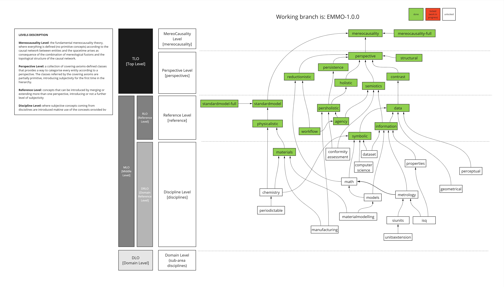

# Elementary Multiperspective Material Ontology (EMMO)

<!-- LOGO -->

  

EMMO is a multidisciplinary effort to develop a standard representational framework (the ontology) for applied sciences.
It is based on physics, analytical philosophy and information and communication technologies.
It has been instigated by materials science to provide a framework for knowledge capture that is consistent with scientific principles and methodologies.
It is released under a Creative Commons [CC BY 4.0](LICENSE.md) license.

## EMMO resources

* The [EMMO Wiki](https://github.com/emmo-repo/EMMO/wiki) is the main resource of documentation.
* A list of EMMO-related publications are available on https://emmc.eu/emmo/.
* Released [EMMO versions].
* Reference index with all EMMO classes and properties: https://w3id.org/emmo/
* [Using Protégé]
* Some notes about the [EMMO name and logo].

## EMMO structure
This repository contain the EMMO top- and middle level ontologies, constituting the core of EMMO.
The EMMO top-level ontology is sub-divided into the fundamental [mereocausality] level and the perspective level, in which the world is described from a set of different perspectives.
The EMMO middle-level ontology is sub-divided into a reference level, which combines perspectives, and a discipline level, providing a common foundation for different disciplines.
Each sub-level are implemented in a set of interdependent modules as illustrated in the figure below.

### Domain Ontologies
Based on the EMMO core, a set of domain-level ontologies have been implemented.
Normally they either import one of the versions of EMMO listed on [https://emmo-repo.github.io/](https://emmo-repo.github.io/) or selected module from EMMO core.
The following table lists the public EMMO-based domain ontologies that we are aware of.
Please create an issue if you have a public domain ontology that you think should be listed here.

| Domain ontology                                           | Link                                                                                                                                 |
|-----------------------------------------------------------|--------------------------------------------------------------------------------------------------------------------------------------|
| Characterisation Methodology Domain Ontology (CHAMEO)     | [https://github.com/emmo-repo/domain-characterisation-methodology](https://github.com/emmo-repo/domain-characterisation-methodology) |
| Battery Interface Ontology (BattINFO)                     | [https://github.com/BIG-MAP/BattINFO](https://github.com/BIG-MAP/BattINFO)                                                           |
| General Process Ontology (GPO)                            | [https://github.com/General-Process-Ontology/ontology](https://github.com/General-Process-Ontology/ontology)                         |
| Ontology for the Battery Value Chain (BVC)                | [https://github.com/Battery-Value-Chain-Ontology/ontology](https://github.com/Battery-Value-Chain-Ontology/ontology)                 |
| Crystallography                                           | [https://github.com/emmo-repo/domain-crystallography](https://github.com/emmo-repo/domain-crystallography)                           |
| CIF ontology                                              | [https://github.com/emmo-repo/CIF-ontology](https://github.com/emmo-repo/CIF-ontology)                                               |
| Domain Ontology for Additive Manufacturing (DOAM)         | [https://github.com/emmo-repo/doam](https://github.com/emmo-repo/doam)                                                               |
| Mechanical Testing                                        | [https://github.com/emmo-repo/domain-mechanical-testing](https://github.com/emmo-repo/domain-mechanical-testing)                     |
| Microstructure domain ontology                            | [https://github.com/emmo-repo/domain-microstructure](https://github.com/emmo-repo/domain-microstructure)                             |
| Datamodel ontology                                        | [https://github.com/emmo-repo/datamodel-ontology](https://github.com/emmo-repo/datamodel-ontology)                                   |
| Mappings ontology                                         | [https://github.com/emmo-repo/domain-mappings](https://github.com/emmo-repo/domain-mappings)                                         |
| Open Translation Environment Interface Ontologies (OTEIO) | [https://github.com/emmo-repo/oteio](https://github.com/emmo-repo/oteio)                                                             |
| Atomistic and Electronic Modelling                        | [https://github.com/emmo-repo/domain-atomistic](https://github.com/emmo-repo/domain-atomistic)                                       |
| EMMO example domain ontologies                            | [https://github.com/emmo-repo/EMMO/tree/master/domain](https://github.com/emmo-repo/EMMO/tree/master/domain)                         |

### Application Ontologies
EMMO application ontologies are engineered for a specific use or application by reusing and extending concepts from one or more domain ontologies.
Even though that the delineation between "domain" and "application" ontologies are somewhat arbitrary, a main difference is that the application ontologies are generally not developed for reuse by other domain or application ontologies, while such reuse is the main focus of domain ontologies.

## Repository Description

The different levels and versions of EMMO can be imported according to the following table:

| Name            | Link                                  | Comment                                                                                          |
|-----------------|---------------------------------------|--------------------------------------------------------------------------------------------------|
| emmo            | https://w3id.org/emmo                 | EMMO middle level                                                                                |
| emmo-tol        | https://w3id.org/emmo/tlo             | EMMO top level                                                                                   |
| emmo-mlo        | https://w3id.org/emmo/mlo             | EMMO middle level                                                                                |
| emmo-full       | https://w3id.org/emmo/emmo-full       | EMMO middle level including the full standard model                                              |
| emmo-for-humans | https://w3id.org/emmo/emmo-for-humans | Version of EMMO middle with IRIs replaced with human readable names. Only intended for examples. |
| emmo-lite       | https://w3id.org/emmo/emmo-lite       | Selected leaf classes and properties for rapid development and deployment in graph databases.    |
| emmo-inferred   | https://w3id.org/emmo/inferred        | Pre-inferred version of EMMO middle level                                                        |

In addition can individual sub-levels and modules be imported from the GitHub repository using their IRI.
Use for example https://w3id.org/emmo/perspectives to import the perspectives sub-level and https://w3id.org/emmo/perspectives/semiotics to import the semiotics module.
A specific version can be imported by adding the version number after the initial https://w3id.org/emmo/.
For example will https://w3id.org/emmo/1.0.0/perspectives import perspectives from version 1.0.0.

> [!NOTE]
> Importing directly from the GitHub repository requires a client that understands `owl:imports`.
> It is also much slower than importing from the links in the above table.

A description of the EMMO Governance, organisation of related repositories, conventions and how to contribute can be found [here](doc/EMMO_governance.md).

---

## Contacts:
You can contact EMMO Authors via emmo@emmc.eu

### Acknowledgement
This work has been supported by several European projects, including:

  - [EMMC-CSA](https://emmc.info) (2016-2019), that has received funding from the European Union’s Horizon 2020 Research and Innovation Programme, under Grant Agreement n. 723867.
  - [SimDOME](https://simdome.eu) (2019-2023), that receives funding from the European Union’s Horizon 2020 Research and Innovation Programme, under Grant Agreement n. 814492.
  - [MarketPlace](https://www.the-marketplace-project.eu) (2018-2022) that receives funding from the European Union’s Horizon 2020 Research and Innovation Programme, under Grant Agreement n. 760173.
  - [VIMMP](https://www.vimmp.eu) (2018-2021) that receives funding from the European Union’s Horizon 2020 Research and Innovation Programme, under Grant Agreement n. 760907.
  - [OntoTrans](https://cordis.europa.eu/project/id/862136) (2020-2024) that receives funding from the European Union’s Horizon 2020 Research and Innovation Programme, under Grant Agreement n. 862136.
  - [ReaxPro](https://cordis.europa.eu/project/id/814416) (2019-2023) that receives funding from the European Union’s Horizon 2020 Research and Innovation Programme, under Grant Agreement n. 814416.
  - [OntoCommons](https://cordis.europa.eu/project/id/958371) (2020-2023) that receives funding from the European Union’s Horizon 2020 Research and Innovation Programme, under Grant Agreement n. 958371.
  - [OYSTER](https://www.oyster-project.eu/) (2017-2021) that receives funding from the European Union’s Horizon 2020 Research and Innovation Programme, under Grant Agreement n. 760827.
  - [NanoMECommons](https://www.nanomecommons.net/) (2021-2025) that receives funding from the European Union’s Horizon 2020 Research and Innovation Programme, under Grant Agreement n. 952869.
  - [OpenModel](https://www.open-model.eu/) (2021-2025) that receives funding from the European Union’s Horizon 2020 Research and Innovation Programme, under Grant Agreement n. 953167.
  - [SFI PhysMet](https://www.ntnu.edu/physmet/) (2020-2028) that receives funding from the Research Council of Norway, project no. 309584.
  - [BIG-MAP](https://www.big-map.eu/) (2020-2024) that receives funding from the European Union’s Horizon 2020 Research and Innovation Programme, under Grant Agreement n. 957189.

This work was conducted using the Protégé resource, which is supported by grant GM10331601 from the National Institute of General Medical Sciences of the United States National Institutes of Health.

[mereocausality]: https://github.com/emmo-repo/EMMO/wiki/Mereocausality
[EMMO versions]: https://emmo-repo.github.io/
[Using Protégé]: doc/using-protege.md
[EMMO name and logo]: doc/about-name-logo.md
