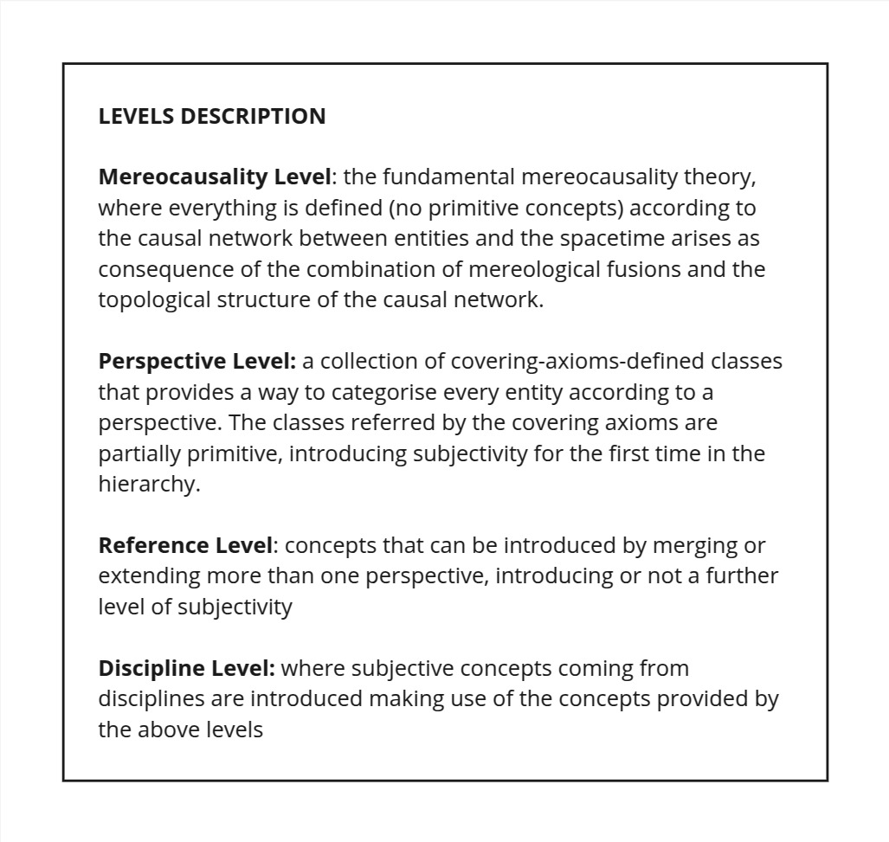
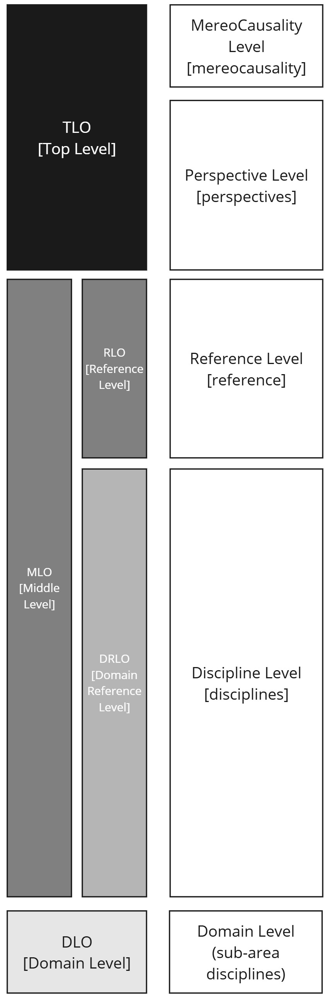

# Elementary Multiperspective Material Ontology (EMMO)

<!-- LOGO -->

  

EMMO results from a multidisciplinary effort to develop a standard representational framework  that is consistent with scientific principles and methodologies.
It is based on physics, analytical philosophy and information and communication technologies.
EMMO provides a framework for knowledge capture and interoperability in applied science and engineering, especially materials science and manufacturing.
It is released under a Creative Commons CC BY 4.0 license.

## EMMO resources

* [EMMO Wiki] - documentation
* [Publication list] - EMMO-related publication list maintained by EMMC
* [EMMO reference index] - all classes and properties
* [Usage tips] - how to work with EMMO using Protégé
* [EMMO name and logo] - some notes about the name

## EMMO structure
This repository contains the EMMO top- and middle level ontologies, constituting the core of EMMO.
The EMMO top-level ontology is consists of the fundamental mereocausality level and the perspective level, which supports a pluralistic representation of the world.

The EMMO middle-level ontology consists of the reference level, which includes the full standard model of physics and the representation of data and information, and the discipline level, providing a common foundation for different disciplines including metrology, materials and manufacturing.
Each level is implemented in a set of interdependent modules as illustrated in the figure below.

<table>
  <tr>
    <td></td>
    <td></td>
  </tr>
</table>

### EMMO levels
The different levels and versions of EMMO can be imported according to the following table:

| Level          | Ontology IRI                         | Description                                                                                            |
|----------------|--------------------------------------|--------------------------------------------------------------------------------------------------------|
| TLO            | https://w3id.org/emmo/tlo            | EMMO top level ontology. Equivalent to perspectives.                                                   |
| MLO            | https://w3id.org/emmo/mlo            | EMMO mid level ontology (excluding the full standard model and specialised units).                     |
| mereocausality | https://w3id.org/emmo/mereocausality | The fundamental mereocausal theory and basic annotations.                                              |
| perspectives   | https://w3id.org/emmo/perspectives   | The EMMO perspectives level.                                                                           |
| reference      | https://w3id.org/emmo/reference      | The EMMO reference level.                                                                              |
| disciplines    | https://w3id.org/emmo/disciplines    | The EMMO disciplines level.                                                                            |
| domain         |                                      | Domain level ontologies maintained in separate repositories. See [below](#domain-ontologies)           |
| application    |                                      | Application level ontologies maintained in separate repositories. See [below](#application-ontologies) |

### EMMO modules
EMMO has a modular structure, where each of the mereocausality, perspectives, reference and disciplines levels contain several modules, as shown in the more [detailed figure of the EMMO structure](doc/figs/EMMO-structure.png).

A table with all modules can be found [here](https://emmo-repo.github.io/module-table.md).

### EMMO versions
EMMO provides in several versions.

| Ontology      | Ontology IRI                        | Description                                                                         |
|---------------|-------------------------------------|-------------------------------------------------------------------------------------|
| EMMO          | https://w3id.org/emmo/emmo          | EMMO mid level ontology. Equivalent to `MLO` in the above table.                    |
| EMMO full     | https://w3id.org/emmo/full/full     | EMMO mid level ontology including the full standard model and specialised units.    |
| HUME          | https://w3id.org/emmo/hume/hume     | [EMMO for humans]: Like `EMMO` but with human-readable IRIs. Intended for examples. |
| ELITE         | https://w3id.org/emmo/elite/elite   | [EMMO LITE]: Subset of `HUME` intended for rapid testing of graph databases.        |
| EMMO inferred | https://w3id.org/emmo/inferred      | Inferred version of `EMMO`.                                                         |
| FULL inferred | https://w3id.org/emmo/full/inferred | Inferred version of `EMMO full`.                                                    |
| HUME inferred | https://w3id.org/emmo/hume/inferred | Inferred version of `HUME`.                                                         |

> [!NOTE]
> Importing any of the above ontologies requires a client that understands `owl:imports`.
> It will also be slow due to recursive import of modules.
> If you only need entities, it will much faster to import any of the namespaces listed below.

## EMMO namespaces
In EMMO, all entities (i.e. classes, properties and individuals) lives in the same namespace.
The namespace depends on the EMMO version according to this table:

| EMMO Version | Prefix | Namespace                    | Description                                                                 |
|--------------|--------|------------------------------|-----------------------------------------------------------------------------|
| EMMO         | emmo   | https://w3id.org/emmo#       | Namespace with all EMMO entities (classes, properties and individuals)      |
| FULL         | full   | https://w3id.org/emmo/full#  | Same as `emmo`, but includes the full standard model and specialised units. |
| HUME         | hume   | https://w3id.org/emmo/hume#  | Like `emmo`, but with the numerical IRIs converted to human readable IRIs.  |
| ELITE        | elite  | https://w3id.org/emmo/elite# | A subset of `hume`, extended with convenient shortcuts.                     |

## EMMO expressivity and reasoning
EMMO 1.0.0 Reference Level is compliant with OWL2 DL and supports HermiT and FaCT++ reasoners.
The axioms have been optimised to reduce reasoning time, facilitating usage and development.
Developers of EMMO based ontologies are encouraged to use a reasoner to ensure consistency with the overall framework.
However, all relevant inferred axioms have been already included in the ontology, so that the EMMO 1.0.0 can also be used as-is with reasoning based on less expressive rules than OWL2 DL, or without reasoning at all, according to users' needs.

## Domain Ontologies
Based on the EMMO core, a set of domain-level ontologies have developed by the community.
They either import one of the versions of EMMO listed on [https://emmo-repo.github.io/](https://emmo-repo.github.io/) or selected module from EMMO core.
The following table lists the public EMMO-based domain ontologies that we are aware of.
Please create an issue if you have a public domain ontology that you think should be listed here.

| Domain ontology                                                                                                           | Base IRI                                                          |
|---------------------------------------------------------------------------------------------------------------------------|-------------------------------------------------------------------|
| [Atomistic and Electronic Modelling](https://github.com/emmo-repo/domain-atomistic)                                       | https://w3id.org/emmo/domain/atomistic#                           |
| [Battery Interface Ontology (BattINFO)](https://big-map.github.io/BattINFO/)                                              | https://w3id.org/battinfo#                                        |
| [Battery Ontology](https://github.com/emmo-repo/domain-battery)                                                           | https://w3id.org/emmo/domain/battery#                             |
| [Characterisation Methodology Domain Ontology (CHAMEO)](https://github.com/emmo-repo/domain-characterisation-methodology) | https://w3id.org/emmo/domain/characterisation-methodology/chameo# |
| [Chemical Substance Domain Ontology (CHEMS)](https://github.com/emmo-repo/domain-chemical-substance)                      | https://w3id.org/emmo/domain/chemical-substance#                  |
| [CIF ontology](https://github.com/emmo-repo/CIF-ontology)                                                                 | http://emmo.info/CIF-ontology/ontology/cif_core#                  |
| [Coating Domain Ontology](https://github.com/emmo-repo/domain-coating)                                                    | https://w3id.org/emmo/domain/coating#                             |
| [Crystallography](https://github.com/emmo-repo/domain-crystallography)                                                    | http://emmo.info/domain-crystallography/crystallography#          |
| [Domain Ontology for Additive Manufacturing (DOAM)](https://github.com/emmo-repo/domain-doam)                             | https://w3id.org/emmo/domain/doam#                                |
| [Domain Ontology for Concrete](https://github.com/emmo-repo/domain-concrete)                                              | https://w3id.org/emmo/domain/concrete#                            |
| [Domain ontology for equivalent circuit models](https://github.com/emmo-repo/domain-equivalent-circuit-model)             | https://w3id.org/emmo/domain/equivalent-circuit-model#            |
| [Domain Ontology for Microscopy (DOM)](https://github.com/emmo-repo/domain-microscopy)                                    | https://w3id.org/emmo/domain/microscopy#                          |
| [Domain ontology for solid oxide fuel cells](https://github.com/emmo-repo/domain-sofc)                                    | https://w3id.org/emmo/domain/sofc#                                |
| [Electrochemistry (ECHO)](https://github.com/emmo-repo/domain-electrochemistry)                                           | https://w3id.org/emmo/domain/electrochemistry#                    |
| [General Process Ontology (GPO)](https://github.com/General-Process-Ontology/ontology)                                    | https://gpo.ontology.link/                                        |
| [Magnetic Materials Ontology (MaMMoS)](https://github.com/MaMMoS-project/MagneticMaterialsOntology/)                      | https://w3id.org/emmo/domain/magnetic_material#                   |
| [Manufacturing domain ontology (MaDO)](https://github.com/emmo-repo/domain-manufacturing)                                 | https://w3id.org/emmo/domain/manufacturing#                       |
| [Microstructure Domain Ontology (MDO)](https://github.com/emmo-repo/domain-microstructure)                                | https://w3id.org/emmo/domain/microstructure#                      |
| [Nanoindentation Ontology](https://github.com/emmo-repo/domain-nanoindentation)                                           | https://w3id.org/emmo/domain/nanoindentation#                     |
| [Nuclear Energy Ontology (NEO)](https://github.com/emmo-repo/domain-neo)                                                  | https://w3id.org/emmo/domain/neo#                                 |
| [Ontology for the Battery Value Chain (BVC)](https://github.com/Battery-Value-Chain-Ontology/ontology)                    | https://bvco.ontology.link/                                       |
| [OTE Interface Ontology (OTEIO)](https://github.com/emmo-repo/domain-oteio)                                               | https://w3id.org/emmo/domain/oteio#                               |

<!--
| [Mechanical Testing](https://github.com/emmo-repo/domain-mechanical-testing)                                              | http://emmo.info/emmo/domain/mechanical-testing#                  |
-->

## Application Ontologies
EMMO application ontologies are engineered for a specific use or application by reusing and extending concepts from one or more domain ontologies.
Even though that the delineation between "domain" and "application" ontologies are somewhat arbitrary, a main difference is that the application ontologies are generally not developed for reuse by other domain or application ontologies, while such reuse is the main focus of domain ontologies.

---

## EMMO Governance and contect
A description of the EMMO Governance, organisation of related repositories, conventions and how to contribute can be found [here](doc/EMMO_governance.md).

You can contact EMMO Authors via emmo@emmc.eu

## Acknowledgement
This work has been supported by several European projects, including:

  - [EMMC-CSA](https://emmc.info) (2016-2019), that has received funding from the European Union’s Horizon 2020 Research and Innovation Programme, under Grant Agreement n. 723867.
  - [SimDOME](https://simdome.eu) (2019-2023), that receives funding from the European Union’s Horizon 2020 Research and Innovation Programme, under Grant Agreement n. 814492.
  - [MarketPlace](https://www.the-marketplace-project.eu) (2018-2022) that receives funding from the European Union’s Horizon 2020 Research and Innovation Programme, under Grant Agreement n. 760173.
  - [VIMMP](https://www.vimmp.eu) (2018-2021) that receives funding from the European Union’s Horizon 2020 Research and Innovation Programme, under Grant Agreement n. 760907.
  - [OntoTrans](https://cordis.europa.eu/project/id/862136) (2020-2024) that receives funding from the European Union’s Horizon 2020 Research and Innovation Programme, under Grant Agreement n. 862136.
  - [ReaxPro](https://cordis.europa.eu/project/id/814416) (2019-2023) that receives funding from the European Union’s Horizon 2020 Research and Innovation Programme, under Grant Agreement n. 814416.
  - [OntoCommons](https://cordis.europa.eu/project/id/958371) (2020-2023) that receives funding from the European Union’s Horizon 2020 Research and Innovation Programme, under Grant Agreement n. 958371.
  - [OYSTER](https://www.oyster-project.eu/) (2017-2021) that receives funding from the European Union’s Horizon 2020 Research and Innovation Programme, under Grant Agreement n. 760827.
  - [NanoMECommons](https://www.nanomecommons.net/) (2021-2025) that receives funding from the European Union’s Horizon 2020 Research and Innovation Programme, under Grant Agreement n. 952869.
  - [OpenModel](https://www.open-model.eu/) (2021-2025) that receives funding from the European Union’s Horizon 2020 Research and Innovation Programme, under Grant Agreement n. 953167.
  - [SFI PhysMet](https://www.ntnu.edu/physmet/) (2020-2028) that receives funding from the Research Council of Norway, project no. 309584.
  - [BIG-MAP](https://www.big-map.eu/) (2020-2024) that receives funding from the European Union’s Horizon 2020 Research and Innovation Programme, under Grant Agreement n. 957189.
  - [MatCHMaker](https://he-matchmaker.eu/) (2023-2027) that receives funding from the European Unio's Horizon Europe Research and Innovation Programme, under Grant Agreement n. 101091687.
  - [PINK](https://pink-project.eu/) (2024-2027) that receives funding from the European Unio's Horizon Europe Research and Innovation Programme, under Grant Agreement n. 101137809.

This work was conducted using the Protégé resource, which is supported by grant GM10331601 from the National Institute of General Medical Sciences of the United States National Institutes of Health.

[EMMO Wiki]: https://github.com/emmo-repo/EMMO/wiki
[Publication list]: https://emmc.eu/emmo/
[EMMO reference index]: https://w3id.org/emmo/
[Usage tips]: doc/using-protege.md
[EMMO name and logo]: doc/about-name-logo.md

<!-- TODO: add better link to EMMO for humans -->
[EMMO for humans]: https://github.com/emmo-repo#the-emmo
[EMMO LITE]: https://github.com/emmo-repo/ELITE

[EMMO versions]: https://emmo-repo.github.io/
[mereocausality]: https://github.com/emmo-repo/EMMO/wiki/Mereocausality
