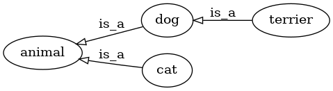
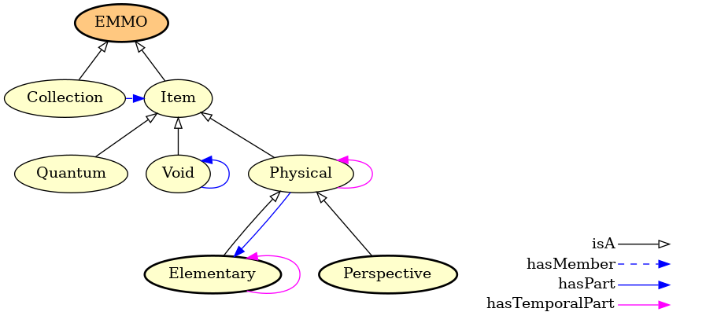

# Introduction

EMMO is a multidisciplinary effort to develop a standard
representational framework (the ontology) based on current materials
modelling knowledge, including physical sciences, analytical
philosophy and information and communication technologies.
This multidisciplinarity is illustrated by the figure on the title page.
It provides the connection between the physical world, materials
characterisation world and materials modelling world.

{ width=620px }

EMMO is based on and is consistent with the [Review of Materials
Modelling][RoMM], [CEN Workshop Agreement][CWA] and [MODA
template][MODA].  However, while these efforts are written for humans,
EMMO is defined using the [Web Ontology Language (OWL)][OWL], which is
machine readable and allows for machine reasoning.  In terms of
semantic representation, EMMO brings everything to a much higher level
than these foundations.

As illustrated in the figure below, EMMO covers all aspects of
materials modelling and characterisation, including:

  - the **material** itself, which must be described in a rigorous way
  - the **observation process** involving an observer that percieves the
    real world (characterisation)
  - the **properties** that are measured or modelled
  - the **physics laws** that describe the material behaviour
  - the **physical models** that approximate the physics laws
  - the **solver** including the numerical discretisation method that
    leads to a solvable mathematical representation under certain
    simplifying assumptions
  - the **numerical solver** that performs the calculations
  - the **post processing** of experimental or simulated data

{ width=360px }

EMMO is released under the [Creative Commons license][CC] and is
available at [emmo.info/][EMMO].  The OWL2-DL sources are available in
RDF/XML format.

## What is an ontology
In short, an ontology is a specification of a conceptualization.  The
word *ontology* has a long history in philosophy, in which it refers
to the subject of existence.  The so-called [ontological
argument][ontological_argument] for the existence of God was proposed
by Anselm of Canterbury in 1078. He defined God as *"that than which
nothing greater can be thought"*, and argued that *"if the greatest
possible being exists in the mind, it must also exist in reality. If
it only exists in the mind, then an even greater being must be
possible -- one which exists both in the mind and in reality"*. Even
though this example has little to do with todays use of ontologies
in e.g. computer science, it illustrates the basic idea;  the ontology
defines some basic premises (concepts and relations between them) from
which it is possible reason to gain new knowledge.

For a more elaborated and modern definition of the ontology we refer
the reader to the one provided by [Tom Gruber (2009)][Gruber2009].
Another useful introduction to ontologies is the paper [Ontology
Development 101: A Guide to Creating Your First Ontology][Ontology101]
by Noy and McGuinness (2001), which is based on the [Protege][Protege]
sortware, with which EMMO has been developed.

A taxonomy is a hierarchical representation of classes and subclasses
connected via `is_a` relations.  Hence, it is a subset of the ontology
excluding all but the `is_a` relations.  The main use of taxonomies is
for the organisation of classifications.  The figure shows a simple
example of a taxonomy illustrating a categorisation of four classes
into a hierarchy of more higher of levels of generality.

{ width=300px }

In EMMO, the taxonomy is a rooted directed acyclic graph (DAG).  This
is important since many classification methods relies on this
property, see e.g. [Valentini (2014)][Valentini2014] and [Robison et
al (2015)][Robison2015].  Note, that EMMO is a DAG does not prevent
some classes from having more than one parent.  A `Variable` is for
instance both a `Mathematical` and a `Symbol`.  See
[appendix][Appendix] for the full EMMO taxonomy.

## Primitive elements in EMMO

{ width=620px }

### Individuals
Individuals are the basic, "ground level" components of EMMO.  They
may include concrete objects such as cars, flowers, stars, persons and
molecules, as well as abstract individuals such as a measured height,
a specific equation and software programs.

Individuals possess attributes in form of axioms that are defined by
the user (interpreter) upon declaration.

### Classes
Classes represent concepts.  They are the building blocks that we use
to create an ontology as a representation of knowledge.  We distinguish
between *defined* and *non-defined* classes.

Defined classes are defined by the requirements for being a member
of the class.  In the graphical representations of EMMO, defined
classes are orange.  For instance, in the graph of the top-level
entity branch below, The root `EMMO` and a defined class (defined to be
the disjoint union of `Item` and `Collection`).

Non-defined classes are defined as an abstract group of objects,
whose members are defined as belonging to the class.  They are yellow
in the graphical representations.

%BRANCHFIG EMMO leafs=Perspective,Elementary caption='Example of the top-level branch of EMMO showing some classes and relationships between them.' width=460

### Axioms
Axioms are propositions in a logical framework that define the
relations between the individuals and classes.  They are used to
categorise individuals in classes and to define the *defined* classes.

The simplest form of a class axiom is a class description that just
states the existence of the class and gives it an unique identifier.
In order to provide more knowledge about the class, class axioms
typically contain additional components that state necessary
and/or sufficient characteristics of the class. OWL contains three
language constructs for combining class descriptions into class
axioms:

* _Subclass_ (`rdfs:subClassOf`) allows one to say that the class
  extension of a class description is a subset of the class extension
  of another class description.

* _Equivalence_ (`owl:equivalentClass`) allows one to say that a class
  description has exactly the same class extension (i.e. the
  individuals associated with the class) as another class description.

* _Distjointness_ (`owl:disjointWith`) allows one to say that the class
  extension of a class description has no members in common with the
  class extension of another class description.

See the section about [Description logic](#description-logic) for more
information about these language constructs.  Axioms are also used to
define relations between relations. These are further detailed in the
chapter on [Relations](#emmo-relations).

## Theoretical foundations
EMMO build upon several theoretical frameworks.

### Semiotics
Semiotics is the study of meaning-making.  It is the dicipline
of formulating something that possibly can exist in a defined
space and time in the real world.

%%It is introdused in EMMO via the
%%`semion` class and used as a way to reduce the complexity of a
%%physical to a simple sign (symbol).  A `Sign` is a physical
%%entity that can represent another object.
%%
%%### Set theory
%%Set theory is the theory of membership. This is introduced via
%%the `set` class, representing the collection of all individuals
%%(signs) that represent a collection of items.  Sets are defined
%%via the `hasMember` relations.

### Mereotopology
Mereotopology is the combination of __mereology__ (science of
parthood) and __topology__ (mathematical study of the geometrical
properties and conservation through deformations).  It is introdused
via the [`Item`](#item) class and based on the
[`mereotopological`](#mereotopological) relations.  Items in EMMO are
always topologically connected in space and time.
EMMO makes a strong distinction between membership and parthood
relations.  In contrast to collections, items can only have parts that
are themselves items.  For further information, see [Casati and Varzi
"Parts and Places" (1999)][Casati1999].

### Physics
EMMO is strongly based on physics, with the aim of being able to
describe all aspects and all domains of physics, from quantum
mechanics to continuum, engeneering, chemistry, etc.  EMMO is
compatible with both the De Broglie - Bohm and the Copenhagen
interpretation of quantum mecanics (see [`Physical`](#physical) for
more comments).

EMMO defines a physics-based parthood hierachy under `Physical` by
introducing the following concepts (illustrated in the figure below):

  * [`Elementary`](#elementary) is the fundamental, non-divisible
    constituent of entities.  In EMMO, elementaries are based on the
    standard model of physics.

  * [`State`](#state) is a `Physical` whose parts does not change
    during its life time (at the chosen level of granularity).  This is
    consistent with a state within e.g. thermodynamics.

  * [`Existent`](#existent) is a succession of states.

{ width=600px }

### Metrology
Metrology is the science of measurements.  It introduces units and
links them to properties.  The description of metrology in EMMO
is based on the standards of
[International System of Quantities (ISQ)](https://en.wikipedia.org/wiki/International_System_of_Quantities)
and
[International System of Units (SI)](https://en.wikipedia.org/wiki/International_System_of_Units).

### Description logic
[Description logic (DL)][DL] is a formal knowledge representation language
in which the *axioms* are expressed.  It is less expressive than
[first-order logic (FOL)][FOL], but commonly used for providing the
logical formalism for ontologies and semantic web.  EMMO is expressed
in the [Web Ontology Language (OWL)][OWL], which in turn is based
on DL.  This brings along features like reasoning.

Since it is essential to have a basic notion of OWL and DL, we
include here a very brief overview.  For a proper introduction to OWL
and DL, we refer the reader to sources like [Grau et.al. (2008)][Grau2008],
[OWL2 Primer][OWL2_Primer] and [OWL Reference][OWL_Reference].

OWL distinguishes between six types of class descriptions:

  1. a class identifier (a IRI reference)
  2. an exhaustive enumeration of individuals that together form the instances
     of a class (`owl:oneOf`)
  3. a property restriction (`owl:someValuesFrom`, `owl:allValuesFrom`,
     `owl:hasValue`, `owl:cardinality`, `owl:minCardinality`,
     `owl:maxCardinality`)
  4. the intersection of two or more class descriptions (`owl:intersectionOf`)
  5. the union of two or more class descriptions (`owl:unionOf`)
  6. the complement of a class description (`owl:complementOf`)

Except for the first, all of these refer to *defined classes*.  The
table below shows the notation in OWL, DL and the [Manchester OWL
syntax][Manchester_OWL], all commonly used for the definitions.  The
Manchester syntax is used by [Protege][Protege] and is designed to not
use DL symbols and to be easy and quick to read and write.  Several
other syntaxes exist for DL.  An interesting example is the pure
Python syntax proposed by [Lamy (2017)][Lamy2017], which is used in
the open source [Owlready2][Owlready2] Python package.  The [Python API
for EMMO][EMMO-python] is also based on Owlready2.

----------------------------------------------------------------------------------------------------------------------------------
DL                 Manchester         [Python + Owlready2        Read                  Meaning
                                      ][Owlready2]
---------------    -----------------  -------------------        -------------------   --------------------
**Constants**

$\top$                                Thing                      top                   A special class with every individual as an instance

$\bot$                                Nothing                    bottom                The empty class

**Axioms**

$A\doteq B$                                                      A is defined to be    Class *definition*
                                                                 equal to B

$A\sqsubseteq B$   A subclass_of B    class A(B): ...            all A are B           Class *inclusion*

                                      issubclass(A, B)                                 Test for *inclusion*

$A\equiv B$        A equivalent_to B  A.equivalent_to.append(B)  A is equivalent to B  Class *equivalence*

                                      B in A.equivalent_to                             Test for equivalence

$a:A$              a is_a A           a = A()                    a is a A              Class *assertion* (*instantiation*)

                                      isinstance(a, A)                                 Test for instance of

$(a,b):R$          a object property  a.R.append(b)              a is R-related to b   Property *assertion*
                   assertion b

$(a,n):R$          a data property    a.R.append(n)              a is R-related to n   Data *assertion*
                   assertion n

**Constructions**

$A\sqcap B$        A and B            A & B                      A and B               Class *intersection* (*conjunction*)

$A\sqcup B$        A or B             A | B                      A or B                Class *union* (*disjunction*)

$\lnot A$          not A              Not(A)                     not A                 Class *complement* (*negation*)

$\{a, b, ...\}$    {a, b, ...}        OneOf([a, b, ...])         one of a, b, ...      Class *enumeration*

$S\equiv R^-$      S inverse_of R     Inverse(R)                 S is inverse of R     Property *inverse*

                                      S.inverse == R                                   Test for *inverse*

$\forall R.A$      R only A           R.only(A)                  all A with R          [*Universal restriction*][universal_restriction]

$\exists R.A$      R some A           R.some(A)                  some A with R         [*Existential restriction*][existential_restriction]

$=n R.A$           R exactly n A      R.exactly(n, A)                                  *Cardinality restriction*

$\leq n R.A$       R min n A          R.min(n, A)                                      *Minimum cardinality restriction*

$\geq n R.A$       R max n A          R.max(n, A)                                      *Minimum cardinality restriction*

$\exists R\{a\}$   R value a          R.value(a)                                       *Value restriction*

**Decompositions**

$A\sqcup B         A disjoint with B  AllDisjoint([A, B])        A disjoint with B     Disjoint
\sqsubseteq\bot$

                                      B in A.disjoints()                               Test for disjointness

$\exists R.\top    R domain A         R.domain = [A]                                   Classes that the restriction applies to
\sqsubseteq A$

$\top\sqsubseteq   R range B          R.range = [B]                                    All classes that can be the value of the restriction
\forall R.B$

----------------------------------------------------------------------------------------------------------------------------------

Table: Notation for DL and Protege. _A_ and _B_ are classes, _R_ is an active
relation, _S_ is an passive relation, _a_ and _b_ are individuals and _n_ is a
literal.  Inspired by the [Great table of Description Logics][Great_table_of_DL].

#### Examples
Here are some examples of different class descriptions using both
the DL and Manchester notation.

##### Equivalence (`owl:equivalentTo`)
Equivalence ($\equiv$) defines necessary and sufficient conditions.

Parent is equivalent to mother or father

  **DL:** `parent` $\equiv$ `mother` $\lor$ `father`

  **Manchester:** `parent equivalent_to mother or father`

##### Inclusion (`rdf:subclassOf`)
Inclusion ($\sqsubseteq$) defines necessary conditions.

An employee is a person.

  **DL:** `employee` $\sqsubseteq$ `person`

  **Manchester:** `employee is_a person`

##### Enumeration (`owl:oneOf`)
The color of a wine is either white, rose or red:

  **DL:** `wine_color` $\equiv$ {`white`, `rose`, `red`}

  **Manchester:** `wine_color equivalent_to {white, rose, red}`

##### Existential restriction (`owl:someValuesFrom`)
A mother is a woman that has a child (some person):

  **DL:** `mother` $\equiv$ `woman` $\sqcap$ $\exists$`has_child`.`person`

  **Manchester:** `mother equivalent_to woman and has_child some person`

##### Universal restriction (`owl:allValuesFrom`)
All parents that only have daughters:

  **DL:** `parents_with_only_daughters` $\equiv$ `person` $\sqcap$ $\forall$`has_child`.`woman`

  **Manchester:** `parents_with_only_daughters equivalent_to person and has_child only woman`

##### Value restriction (`owl:hasValue`)
The owl:hasValue restriction allows to define classes based on the
existence of particular property values. There must be at least one
matching property value.

All children of Mary:

  **DL:** `Marys_children` $\equiv$ `person` $\sqcap$ $\exists$`has_parent`.{`Mary`}

  **Manchester:** `Marys_children equivalent_to person and has_parent value Mary`

##### Property cardinality (`owl:cardinality`)
The owl:cardinality restrictions ($\geq$, $\leq$ or $\equiv$) allow to
define classes based on the maximum (owl:maxCardinality), minimum
(owl:minCardinality) or exact (owl:cardinality) number of occurences.

A person with one parent:

  **DL:** `half_orphant` $\equiv$ `person` and =1`has_parent`.`person`

  **Manchester:** `half_orphant equivalent_to person and has_parent exactly 1 person`

##### Intersection (`owl:intersectionOf`)
Individuals of the intersection ($\sqcap$) of two classes, are
simultaneously instances of both classes.

A man is a person that is male:

  **DL:** `man` $\equiv$ `person` $\sqcap$ `male`

  **Manchester:** `man equivalent_to person and male`

##### Union (`owl:unionOf`)
Individuals of the union ($\sqcup$) of two classes, are either instances
of one or both classes.

A person is a man or woman:

  **DL:** `person` $\equiv$ `man` $\sqcup$ `woman`

  **Manchester:** `person equivalent_to man or woman`

##### Complement (`owl:complementOf`)
Individuals of the complement ($\lnot$) of a class, are all
individuals that are not member of the class.

Not a man:

  **DL:** `female` $\equiv$ $\lnot$ `male`

  **Manchester:** `female equivalent_to not male`

## The structure of EMMO

The EMMO ontology is structured in shells, expressed by specific ontology fragments, that extends from fundamental concepts to the application domains, following the dependency flow.

### Top Level
The [EMMO top level](top.owl) is the group of fundamental axioms that constitute the philosophical foundation of the EMMO.  Adopting a physicalistic/nominalistic perspective, the EMMO defines real world objects as 4D objects that are always extended in space and time (i.e. real world objects cannot be spaceless nor timeless).  For this reason abstract objects, i.e. objects that does not extend in space and time, are forbidden in the EMMO.

EMMO is strongly based on the analytical philosophy dicipline semiotic.
The role of abstract objects are in EMMO fulfilled by semiotic objects, i.e. real world objects (e.g. symbol or sign) that stand for other real world objects that are to be interpreted by an agent. These symbols appear in actions (semiotic processes) meant to communicate meaning by establishing relationships between symbols (signs).

Another important building block of from analytical philosophy is atomistic mereology applied to 4D objects.  The EMMO calls it 'quantum mereology', since the there is a epistemological limit to how fine we can resolve space and time due to the uncertanity principles.

The [mereotopology](top/mereotopology.owl) module introduces the fundamental mereotopological concepts and their relations with the real world objects that they represent.  The EMMO uses mereotopology as the ground for all the subsequent ontology modules.  The concept of topological connection is used to define the first distinction between ontology entities namely the *Item* and *Collection* classes.  Items are causally self-connected objects, while collections are causally disconnected.  Quantum mereology is represented by the *Quantum* class. This module introduces also the fundamental mereotopological relations used to distinguish between space and time dimensions.

The [physical](top/physical.owl) module, defines the *Physical* objects and the concept of *Void* that plays a fundamental role in the description of multiscale objects and quantum systems. It also define the *Elementary* class, that restricts mereological atomism in space.

{ width=440px }

In EMMO, the only univocally defined real world object is the *Item* individual called **Universe** that stands for the universe. Every other real world object is a composition of elementaries up to the most comprehensive object; the **Universe**. Intermediate objects are not univocally defined, but their definition is provided according to some specific philosophical perspectives.  This is an expression of reductionism (i.e. objects are made of sub-objects) and epistemological pluralism (i.e. objects are always defined according to the perspective of an interpreter, or a class of interpreters).

The *Perspective* class collects the different ways to represent the objects that populate the conceptual region between the elementary and universe levels.

### Middle Level
The middle level ontologies act as roots for extending the EMMO towards specific application domains.

The *Reductionistic* perspective class uses the fundamental non-transitive parthood relation, called direct parthood, to provide a powerful granularity description of multiscale real world objects. The EMMO can in principle represents the **Universe** with direct parthood relations as a direct rooted tree up to its elementary constituents.

The *Phenomenic* perspective class introduces the concept of real world objects that express of a recognisable pattern in space or time that impress the user. Under this class the EMMO categorises e.g. formal languages, pictures, geometry, mathematics and sounds. Phenomenic objects can be used in a semiotic process as signs.

The *Physicalistic* perspective class introduces the concept of real world objects that have a meaning for the under applied physics perspective.

The *Holistic* perspective class introduces the concept of real world objects that unfold in time in a way that has a meaning for the EMMO user, through the definition of the classes *Process* and *Participant*.
The [semiotics](top/semiotics.owl) module introduces the concepts of
semiotics and the *Semiosis* process that has a *Sign*, an *Object*
and an *Interpreter* as participants.  This forms the basis in EMMO to
represent e.g. models, formal languages, theories, information and
properties.

{ width=540px }

### EMMO relations
All EMMO relations are subrelations of the relations found in the two roots: *mereotopological* and *semiotical*. The relation hierarchy extends more vertically (i.e. more subrelations) than horizontally (i.e. less sibling relations), facilitating the categorisation and inferencing of individuals.
See also the chapter [EMMO Relations](#emmo-relations).

Imposing all relations to fall under mereotopology or semiotics is how the EMMO force the developers to respect its perspectives. Two entities are related only by contact or parthood (mereotopology) or by standing one for another (semiosis): no other types of relation are possible within the EMMO.

A unique feature in EMMO, is the introduction of _direct parthood_.
As illustrated in the figure below, it is a mereological relation
that lacks transitivity.  This makes it possible to entities made of
parts at different levels of granularity and to go between granularity
levels in a well-defined manner.  This is paramount for cross
scale interoperability.  Every material in EMMO is placed on a
granularity level and the ontology gives information about the direct
upper and direct lower level classes using the non-transitive direct
parthood relations.

{ width=220px }

### Annotations
All entities and relations in EMMO have some attributes, called
*annotations*.  In some cases, only the required *International
Resource Identifier* (IRI) and *relations* are provided.  However,
descriptive annotations, like *elucidation* and *comment*, are planned
to be added for all classes and relations.  Possible annotations are:

* __Elucidation__ is a human readable explanation and clearification
  of the documented class or relation.
* __Example__ clearifies the elucidation through an example.  A class may
  have several examples, each addressing different aspects.
* __Comment__ is a clearifying note complementing the definition and
  elucidation.  A class may have several comments, each clearifying
  different aspects.
* __IRI__ stands for *international resource identifier*.  It is an
  identifier that uniquely identifies the class or relation.  IRIs are
  similar to URIs, but are not restricted to the ASCII character set.
  In EMMO, the IRIs are now valid URLs pointing to the stable version of
  EMMO.
* __Relations__ is a list of relations applying to the current class
  or relation.  The relations for relations are special and will be
  elaborated on in the introduction to chapter [Relations].  Some of
  the listed relations are defined in the OWL sources, while other are
  inferred by the reasoner.  The relations are expressed using the Manchester
  OWL syntax introduced in section [Description logic](#description-logic).

%%### Graphs
%%The generated graphs borrow some syntax from the [Unified Modelling
%%Language (UML)][UML], which is a general purpose language for software
%%design and modelling.  The table below shows the style used for the
%%different types of relations and the concept they correspond to in
%%UML.
%%
%%Relation           UML arrow     UML concept
%%-------------      -----------   -----------
%%is-a               ![img][isa]   inheritance
%%disjoint_with      ![img][djw]   association
%%equivalent_to      ![img][eqt]   association
%%encloses           ![img][rel]   aggregation
%%has_abstract_part  ![img][rel]   aggregation
%%has_abstraction    ![img][rel]   aggregation
%%has_representation ![img][rel]   aggregation
%%has_member         ![img][rel]   aggregation
%%has_property       ![img][rel]   aggregation
%%
%%Table: Notation for arrow styles used in the graphs.  Only active
%%relations are listed. Corresponding passive relations use the same
%%style.
%%
%%[isa]: figs/arrow-is_a.png "inheritance"
%%[djw]: figs/arrow-disjoint_with.png "association"
%%[eqt]: figs/arrow-equivalent_to.png "association"
%%[rel]: figs/arrow-relation.png "aggregation"

%%All relationships have a direction.  In the graphical visualisations,
%%the relationships are represented with an arrow pointing from the
%%subject to the object.  In order to reduce clutter and limit the size
%%of the graphs, the relations are abbreviated according to the
%%following table:
%%
%%Relation                        Abbreviation
%%--------                        ------------
%%has_part only                   hp-o
%%is_part_of only                 ipo-o
%%has_member some                 hm-s
%%is_member_of some               imo-s
%%has_abstraction some            ha-s
%%is_abstraction_of some          iao-s
%%has_abstract_part only          pap-o
%%is_abstract_part_of only        iapo-o
%%has_space_slice some            hss-s
%%is_space_slice_of some          isso-s
%%has_time_slice some             hts-s
%%is_time_slice_of some           itso-s
%%has_projection some             hp-s
%%is_projection_of some           ipo-s
%%has_proper_part some            hpp-s
%%is_proper_part_of some          ippo-s
%%has_proper_part_of some         hppo-s
%%has_spatial_direct_part min     hsdp-m
%%has_spatial_direct_part some    hsdp-s
%%has_spatial_direct_part exactly hsdp-e
%%
%%Table: Abbriviations of relations used in the graphical representation
%%of the different subbranches.
%%
%%
%%UML represents classes as a box with three compartments; names, attributes
%%and operators.  However, since the classes in EMMO have no operators and
%%since it gives little meaning to include the OWL annotations as attributes,
%%we simply represent the classes as boxes by a name.
%%
%%As already mentioned, defined classes are colored orange, while
%%undefined classes are yellow.
%%
%%
%%<!--
%%## Further work
%%
%%-->

[CC]: http://emmo.info/blob/v1.0.0/LICENSE.md
[EMMO]: https://github.com/emmo-repo/EMMO/
[RoMM]: https://publications.europa.eu/en/publication-detail/-/publication/ec1455c3-d7ca-11e6-ad7c-01aa75ed71a1
[CWA]: https://www.cen.eu/news/workshops/Pages/WS_2016-013.aspx
[MODA]: https://emmc.info/moda-workflow-templates/
[ontological_argument]: https://en.wikipedia.org/wiki/Ontological_argument
[Valentini2014]: https://arxiv.org/abs/1406.4472
[Robison2015]: https://www.google.no/url?sa=t&rct=j&q=&esrc=s&source=web&cd=2&ved=0ahUKEwi_2vv-8tXbAhUFiiwKHVRdD4EQFgg1MAE&url=https%3A%2F%2Fwww.springer.com%2Fcda%2Fcontent%2Fdocument%2Fcda_downloaddocument%2F9783319202471-c2.pdf%3FSGWID%3D0-0-45-1510685-p177420182&usg=AOvVaw39c3v4a5PfVMEYDulWpF3w
[Gruber2009]: http://tomgruber.org/writing/ontology-definition-2007.htm
[Ontology101]: http://www.ksl.stanford.edu/people/dlm/papers/ontology-tutorial-noy-mcguinness-abstract.html
[DL]: https://en.wikipedia.org/wiki/Description_logic
[OWL]: https://en.wikipedia.org/wiki/Web_Ontology_Language
[FOL]: https://en.wikipedia.org/wiki/First-order_logic
[Casati1999]: https://mitpress.mit.edu/books/parts-and-places
[Grau2008]: http://www.cs.ox.ac.uk/boris.motik/pubs/ghmppss08next-steps.pdf
[OWL2_Primer]: https://www.w3.org/TR/owl2-primer/
[OWL_Reference]: https://www.w3.org/TR/owl-ref/
[Manchester_OWL]: http://ceur-ws.org/Vol-216/submission_9.pdf
[Owlready2]: https://pythonhosted.org/Owlready2/
[Lamy2017]: http://www.lesfleursdunormal.fr/_downloads/article_owlready_aim_2017.pdf
[EMMO-python]: https://github.com/emmo-repo/EMMO-python
[Great_table_of_DL]: http://www.lesfleursdunormal.fr/static/_downloads/great_ontology_table.pdf
[universal_restriction]: https://en.wikipedia.org/wiki/Universal_quantifier
[existential_restriction]: https://en.wikipedia.org/wiki/Universal_quantifier
[Protege]: https://protege.stanford.edu/
[UML]: http://www.uml.org/
